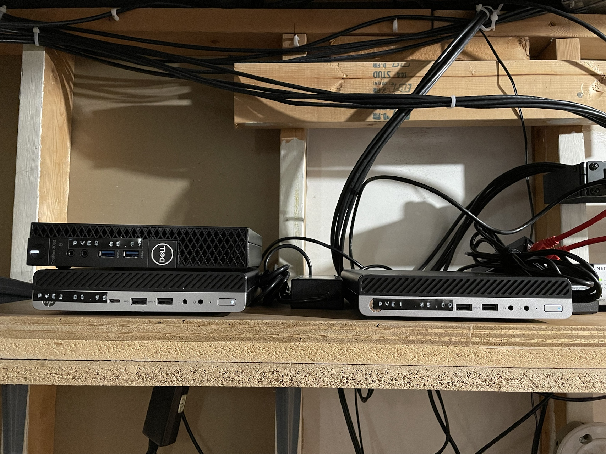

---
aliases:
- /configuration/linux/proxmox/2022/12/31/proxmox2
categories:
- configuration
- linux
- proxmox
date: '2022-12-31'
description: Homelab cluster adventures continue
layout: post
title: Home cluster part 2 - Configuring Proxmox
toc: true

---

# Introduction

In [part 1](https://blog.ianpreston.ca/configuration/linux/2022/11/21/proxmox.html) of
this series I laid out the rationale for building a homelab cluster, walked through my
hardware selection, and ran through the proxmox installer. In this post I'll document
the further configuration of the cluster and its nodes. The actual implementation will
be done in ansible and tracked in my [recipes](https://github.com/ianepreston/recipes)
repository, so I will keep it light on code in this post. What I'm going to try and
document here is the steps I took, why I took them, and any weird edge cases or other
fun learning opportunities I encounter in the process.

# The goals for this post

By the end of this post I'd like to have accomplished the following things with my cluster:

- Set up their entries in ansible and be able to connect to each node individually or
address them as a group
- Turn off the enterprise repository and add the non-enterprise one
- Make each node aware of my UPS state (one directly and the other two as clients)
- Set up email alerting
- Configure locale settings
- Set up my NAS as a storage target

# What I'm working on

Just for kicks, let's include an actual picture of these nodes I'm working on in this post:



Here they are, sitting in my utility room near the rest of my gear. So cute!

# The code

The playbook I built for this is available [here](https://github.com/ianepreston/recipes/blob/master/ansible/pve.yml). That link points to the main playbook, and the repository more generally has the
custom roles and other configs I made to get everything set up.

# Ansible connectivity

I haven't set up these hosts to use key based authentication yet, and decided to just
try password auth. I ended up getting some host key errors, which I didn't quite understand.
At first I thought it was something with the devcontainer config I was using, but I tried
the same thing on the host system and got the same error. After that I realized it was
because I'd reinstalled that host and the key I had saved in `~/.ssh/known_hosts` was
from the old install. After clearing out that record I was able to ssh to all three hosts
from my main system. I then had to refresh the devcontainer so it would copy in an updated
copy of my `~/.ssh/known_hosts` file. I'm not sure how frequently devcontainers normally
refresh that, but it's a config alignment issue I'll have to keep in mind for future
problems. Anyway, beside that little known hosts config issue, adding all three hosts
and addressing them in the `pve` group all worked fine.

# Set up the non-subscription repository

Proxmox has two repositories for package updates, one for Enterprise subscribers, and
one for non-subscribers. By default it comes with the enterprise repository enabled,
but since I'm not a subscriber I want to switch repos. Ansible comes with a built in
[apt repository](https://docs.ansible.com/ansible/latest/collections/ansible/builtin/apt_repository_module.html)
module so that was an easy way to ensure the enterprise repo was absent from my sources list
and that all the recommended ones (including for CEPH) were included. I set that role
to also update my repository list and upgrade all installed packages for good measure as
well using the [apt](https://docs.ansible.com/ansible/latest/collections/ansible/builtin/apt_module.html)
module.

# Set up UPS state alerting

## Failed first attempt

I made a good amount of progress trying to set this up a certain way, but eventually hit
a wall. Some of what I tried originally is still interesting, it just didn't work.
The core issue is that I was dynamically identifying which host had the UPS attached to
it based on the output of a locally run command on each  host. This worked fine in terms
of setting conditionals to only do server setup stuff on the node with the UPS attached,
but ran into troubles configuring the clients. The clients need to know the hostname of
the server, but I couldn't figure out any way to dynamically identify that host in an
ansible playbook. Registered variables from commands (what I was using to identify which
host was connected to the UPS) are host variables only, so the other hosts didn't have 
access to it. From the look of it you can't really make a host variable a global variable
based on a condition. There might be a way to concatenate all host variables in a way
that would let me get ` <server host> + '' + '' == <server host>` as the output for
all hosts, but that felt pretty hacky. Based on this I'm just going to hard code which
host is directly connected to the UPS and build my playbook from that.

### Borked attempt write up

One node in my cluster is connected via USB to my UPS. In the event of a power failure
I want it to be alerted via that USB connection, and then pass that alert on to the
other nodes via [NUT](https://networkupstools.org/). I'm largely relying on the
[Arch wiki](https://wiki.archlinux.org/title/Network_UPS_Tools) to set this up, even
though proxmox is Debian based, just because that wiki is amazing. I also found
[this repository](https://github.com/ykuksenko/ansible.nut) which has a role configured
for setting up nut. It's set up in a different way than I want, and also has a lot more
abstraction that's good for portability but bad for interpretability, so I won't use
it directly.

The first thing I want to do is install the `nut` utility on all the systems, as with
the previous section this is easily accomplished with the apt module in ansible.

Next I need to identify which system has the UPS USB cable connected to it, as this one
will be the NUT server, and the others will be NUT clients. Realistically this is not
going to change and I could just hard code it, but I thought it would be fun to figure
out how to automate it.

The `nut` package comes with a `nut-scanner` utility which can be used to identify
compatible devices. I can register the output of that command in ansible and then
set a [conditional](https://docs.ansible.com/ansible/latest/playbook_guide/playbooks_conditionals.html#conditions-based-on-registered-variables) to only perform certain operations if
the output of the command listed a USB device. To test this before I actually applied
anything with conditionals I used the [debug](https://docs.ansible.com/ansible/latest/collections/ansible/builtin/debug_module.html) module to output which host had the UPS attached. I won't keep that
debug in my final playbook, so I'll reproduce that part here:

```yml
- name: Check if USB for UPS is connected to this host
  ansible.builtin.shell: nut-scanner -U -P
  register: ups_driver

- name: Show me which host has the UPS connected
  ansible.builtin.debug:
    msg: System {{ inventory_hostname }} has UPS driver {{ ups_driver }}
  when: ups_driver.stdout.find('usbhid-ups') != -1
```

Next is to configure the driver on connected system. To do this I copy over a `ups.conf`
file based on the output of the `nut-scanner` command. After copying over the template
I test it by sshing into the machine and running `upsdrvctl start`. Since that looked good
I enable the `nut-driver` service with ansible's systemd module.

After that it's time to set up the nut server for clients (both the local machine and
the other nodes in the cluster) to connect to. Following the Arch wiki I created a
`upsd.users` file with user configuration for the clients and then tried to enable and
start the nut server. I didn't get an error from ansible for this, but when I tried to
check the server I got nothing, and checking the state of the service I saw that it was
dead. The relevant lines in the service status seemed to be:

```bash
upsd disabled, please adjust the configuration to your needs
Then set MODE to a suitable value in /etc/nut/nut.conf to enable it
```
Taking a look at that file I see this:

```bash
##############################################################################
# The MODE determines which part of the NUT is to be started, and which
# configuration files must be modified.
#
# This file try to standardize the various files being found in the field, like
# /etc/default/nut on Debian based systems, /etc/sysconfig/ups on RedHat based
# systems, ... Distribution's init script should source this file to see which
# component(s) has to be started.
#
# The values of MODE can be:
# - none: NUT is not configured, or use the Integrated Power Management, or use
#   some external system to startup NUT components. So nothing is to be started.
# - standalone: This mode address a local only configuration, with 1 UPS
#   protecting the local system. This implies to start the 3 NUT layers (driver,
#   upsd and upsmon) and the matching configuration files. This mode can also
#   address UPS redundancy.
# - netserver: same as for the standalone configuration, but also need
#   some more network access controls (firewall, tcp-wrappers) and possibly a
#   specific LISTEN directive in upsd.conf.
#   Since this MODE is opened to the network, a special care should be applied
#   to security concerns.
# - netclient: this mode only requires upsmon.
#
# IMPORTANT NOTE:
#  This file is intended to be sourced by shell scripts.
#  You MUST NOT use spaces around the equal sign!

MODE=none
```
So based on this I think I need ansible to remove the `MODE=none` line and change it to
`MODE=netserver` on the server. Probably it will have to be `MODE=netclient` on the
clients, but let's leave that alone for now. I can handle this using the
[lineinfile](https://docs.ansible.com/ansible/latest/collections/ansible/builtin/lineinfile_module.html)
module. After doing this and restarting the `nut-server` service I ran `upsc pveups` and
had the state of the UPS returned, indicating the config was good for the directly
connected node. **This is where I got stuck, see the write up above**

## Working second attempt

Don't reinvent the wheel folks. I vendored in [this role](https://github.com/ykuksenko/ansible.nut)
and got everything working pretty much right away. I did have to hard code which
host was attached to the UPS, but that's a small price to pay. Problem solved!


# Setup email alerting

The next thing I want is to set up an outbound email configuration, so I can receive
email alerts for things like backups or drive issues. The general idea for configuring
this comes from [Techno Tim](https://docs.technotim.live/posts/proxmox-alerts/). I'm
learning my lesson from NUT and not trying to roll my own ansible role, instead I'm
using [this role](https://github.com/Oefenweb/ansible-postfix) I found on GitHub.

I set up the playbook to run, ansible indicated it had made some changes, so I tried
sending an email from the command line with

```bash
echo "This is a test message sent from postfix on my Proxmox Server" | mail -s "Test Email from Proxmox" <my.email@address.com>
```

But nothing went out. Ok, time to troubleshoot.

- Check if postfix service is up with `systemctl status postfix`. It looks fine
- Check if I have a correct looking config in `/etc/postfix/sasl_passwd`. I do and
  there's the `sasl_passwd.db` file in that folder as well that I'd expect
- Check `/etc/postfix/main.cf`. Config looks ok
- Check `/var/log/mail.log`. Pertinent error seems to be around this:
  ```bash
   status=bounced (host smtp.gmx.com[212.227.17.184] said: 550-Requested action not taken: mailbox unavailable 550 invalid DNS MX or A/AAAA resource record (in reply to MAIL FROM command))
  ```
- Figure I probably set up `postfix_aliases` wrong in the role variables, so change
  that and try again. Slightly different error
  ```bash
  status=bounced (host smtp.gmx.com[212.227.17.174] said: 550-Requested action not taken: mailbox unavailable 550 Sender address is not allowed. (in reply to MAIL FROM command))
  ```
- Realize that I was using `postfix_aliases` the way I should have been using 
  `postfix_sender_canonical_maps`. Redo that part.

Email sent! Right now they all show up as just coming from `root`. Per the Techno Tim
docs linked above I know there's a way to make that a more informative name. This would
work, but I'd like it to say which host it's actually coming from.

I took a guess from the Techno Tim post and figured the config I needed to change
in the playbook would be `postfix_header_checks` and after poking around in the
related jinja templates and looking at what the Techno Tim post said to write I got a
config together that at least didn't blow up. Sent a test email again and:

```bash
 status=bounced (host smtp.gmx.com[212.227.17.184] said: 554-Transaction failed 554-Reject due to policy restrictions. 554 For explanation visit https://postmaster.gmx.net/en/error-messages?ip=24.64.146.237&c=hi (in reply to end of DATA command))
 ```

 Ok, this isn't a critical feature, but I can handle hacking at it for a bit before I
 give up.

 - Compare what's in my `/etc/postfix/header_checks` to what the guide showed: It looks
  mostly the same, although I've got `.`s in my name since I used the `{{ ansible_hostname }}` variable to define it. Maybe that's it? Nope. Same error.
- Techno Tim blog installed `postfix-pcre` to enable this. Playbook didn't by default.
  Add that to the `postfix_install` var and try again: Still bounced.
- Notice that in the Techno Tim post he didn't bother including a real email in the
  replacement line because it wasn't supposed to matter. Maybe GMX actually cares (
  his example had been for gmail). Update the variable so it keeps my real email for
  that part and just changes the name: It works!

# Configure locale settings

Around this time I noticed I was getting some error messages when I would connect to a
shell on the nodes: `perl: warning: Please check that your locale settings:`. I already
had a role created to set up locales for previously configured hosts, so this was an easy
fix, I just had to add it to the playbook for these hosts. Not much to say about this,
just noting it here for completeness.

# Set up NFS shares

I already configured this manually, but now I'd like to make sure
it stays configured if I rebuild, so I'll move it into ansible.

According to the [proxmox docs](https://pve.proxmox.com/wiki/Storage:_NFS) the configuration is stored in `/etc/pve/storage.cfg`.

Taking a look in there I can see that I do have a NFS share configured there, along with my local and zfs storage.

This seems like a great use case for the [blockinfile](https://docs.ansible.com/ansible/latest/collections/ansible/builtin/blockinfile_module.html) module in ansible.

Well this is weird. After removing the original block from that file
and having ansible add it, I can access the mount point from the
terminal on all my hosts, but it no longer shows up as a storage
option in the UI.

After doing a reboot and some further testing I confirmed that removing that entry should
remove it from the mount point and the UI (and it does). Adding the entry back does not
seem to add the storage either to the mount point or the UI. I'm not sure why that would
be, so let's see what else there is to do.

Looking more through the proxmox docs I see there's a [pve storage manager](https://pve.proxmox.com/pve-docs/chapter-pvesm.html) command. Maybe what I should do instead is check if that share
is in the config file, and if it's not run a shell command to add it.

In doing some testing for the shell command, I confirmed that all the shell command does
is fill in an entry in the file mentioned above. After some further testing, the issue
seems to be related to the `#Ansible Managed Block` comments the ansible function
places around the entry. Something about needing blank lines around entries. By modifying
the block marker to have newlines on either side of the comment I was able to use
blockinfile to set up the share. Easier than parsing shell output and sending a big long
command. I could have set this to be applied to all hosts, but since this is in `/etc/pve`
the cluster manager will handle replication across hosts for me.

# Conclusion

In this post I covered a bunch of configuration I wanted to have in place on my proxmox
nodes before I got into the business of actually deploying anything. Stay tuned for my
next post in this series where maybe I'll actually use the cluster for what it was intended
for and spin up some VMs.